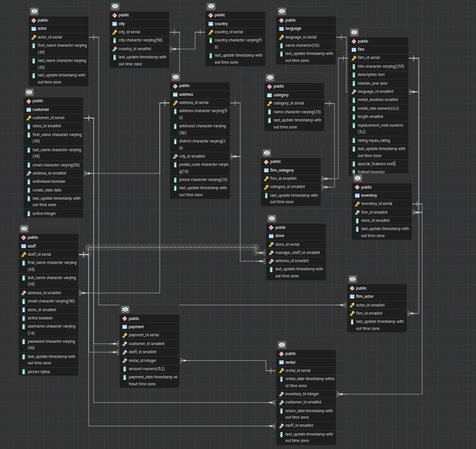

## Explanation of Every Join used

* **INNER JOIN**: The only join type utilized across all queries. It extracts records possessing matching values in both connecting tables.
* **customer JOIN address**: Connects customer profiles to physical addresses using `address_id`.
* **address JOIN city**: Links addresses to geographic cities via `city_id`.
* **city JOIN country**: Maps cities to their respective countries using `country_id`.
* **payment JOIN customer**: Links financial transactions to the purchasing customer via `customer_id`.
* **payment JOIN rental**: Connects a payment to its specific rental transaction using `rental_id`.
* **rental JOIN inventory**: Matches a rental event to the exact physical item rented via `inventory_id`.
* **inventory JOIN film**: Links physical stock to movie metadata using `film_id`.
* **film JOIN film_category**: Junction table connection associating films to category mappings using `film_id`.
* **film_category JOIN category**: Retrieves category names by linking the junction table to the category lookup via `category_id`.
* **film JOIN film_actor**: Junction table connection associating films to cast members using `film_id`.
* **film_actor JOIN actor**: Retrieves actor names by linking the junction table to the actor lookup via `actor_id`[cite: 1].
* **store JOIN address**: Connects retail locations to their precise addresses via `address_id`[cite: 1].
* **store JOIN inventory**: Links physical items to the specific store holding them using `store_id`[cite: 1].

## ERD

## How each question was solved

- Customer Demographics: Extracted first name, last name, email, city, and country by chaining customer, address, city, and country tables.
- Payment Details: Displayed customer name, payment amount, date, and film title by linking payment, customer, rental, inventory, and film.
- Top 10 Customers: Joined payment to customer, aggregated the amount column utilizing SUM(), grouped by name, ordered descending, and limited the output to 10 records.
- Film Categories & Rates: Displayed film titles, rental rates, and category names by chaining film, film_category, and category.
- Actor Appearances: Connected film, film_actor, and actor to display movie titles alongside actor names.

- Category Film Count: Joined category and film_category, aggregated via COUNT(film_id), and grouped by category name.
- Highest Revenue Categories: Linked category down to payment through 5 sequential joins, summing the amount column and grouping by category name to sort total revenue descending.
- High Volume Renters: Joined customer, rental, and inventory, utilizing HAVING COUNT(film_id) > 20 to strictly filter the grouped output.
- Top Revenue Cities: Joined store to address to city, and linked down to payment to aggregate total transaction amounts grouped strictly by geographic city

## Three Business Insights from the results

Identifying top spending customers and high volume renters establishes a precise target list for premium loyalty programs.

Tracking revenue generation by category allows the business to securely allocate purchasing budgets toward highly profitable genres.

Grouping rental revenue by specific cities isolates geographic areas with the highest market demand to inform future retail expansion.